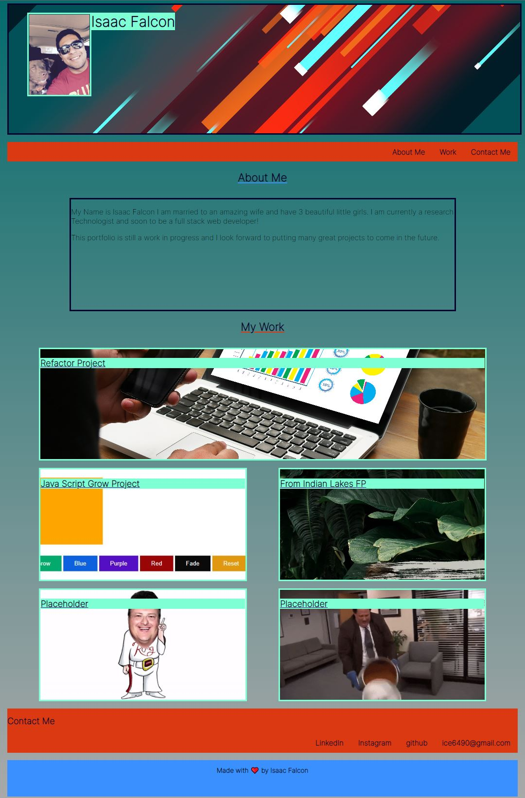

# Description

- Website Main Focus- To help keep a main location and display all my work in a portfolio style. Will constantly update as new projects are finished.

## Changes Made

- Added Proper Semantic elements in HTML and CSS Files.
- Added header with profile pic and name.
- Added nav bar to link to different sections of website.
- Added about me section, that will updated more in the future.
- Added project buttons with main project on top and with placeholders for projects to come.
- Added bottom nav bar with links to linkedIn, instagram, github, and an email for contact.
- Added responsiveness for smaller devices.

## Table of Contents

- [Usage](#usage)
- [Credits](#credits)
- [License](#license)

## Usage

Link: https://github.com/IsaacFalcon/IsaacFalconPortfolio.git

## Credits

https://developer.mozilla.org/en-US/docs/Web/HTML/Element

https://www.youtube.com/watch?v=fYq5PXgSsbE&t=442s

## License

MIT License

Copyright (c) [2022] [Isaac Falcon]

Permission is hereby granted, free of charge, to any person obtaining a copy
of this software and associated documentation files (the "Software"), to deal
in the Software without restriction, including without limitation the rights
to use, copy, modify, merge, publish, distribute, sublicense, and/or sell
copies of the Software, and to permit persons to whom the Software is
furnished to do so, subject to the following conditions:

The above copyright notice and this permission notice shall be included in all
copies or substantial portions of the Software.

THE SOFTWARE IS PROVIDED "AS IS", WITHOUT WARRANTY OF ANY KIND, EXPRESS OR
IMPLIED, INCLUDING BUT NOT LIMITED TO THE WARRANTIES OF MERCHANTABILITY,
FITNESS FOR A PARTICULAR PURPOSE AND NONINFRINGEMENT. IN NO EVENT SHALL THE
AUTHORS OR COPYRIGHT HOLDERS BE LIABLE FOR ANY CLAIM, DAMAGES OR OTHER
LIABILITY, WHETHER IN AN ACTION OF CONTRACT, TORT OR OTHERWISE, ARISING FROM,
OUT OF OR IN CONNECTION WITH THE SOFTWARE OR THE USE OR OTHER DEALINGS IN THE
SOFTWARE.

---

## Badges

